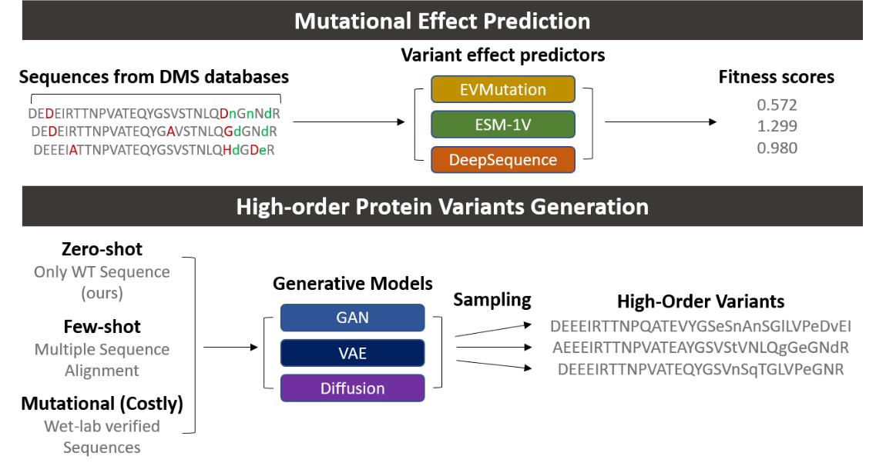

# PseudoMSA: Towards High-fitness Protein Variant Generation Guided by Protein Language Models

[](https://opensource.org/licenses/Apache-2.0)

This is the public repo for the project *PseudoMSA: Towards High-fitness Protein Variant Generation Guided by Protein Language Models.* **PseudoMSA** can generate high-fidelity high-fitness protein mutants in zero shot: only a wildtype sequence of the protein is required for generation. The generation process is rounds of _in silico_ <a href="https://en.wikipedia.org/wiki/Directed_evolution" title="DE">directed evolution</a> guided by the 'intrinsic fitness' informed by a Protein Language Model (more on latter).

## Install
### Requirements 
Python >= 3.6; PyTorch >= 1.10.0; CUDA >= 10.1; **Special Branch** of Hugging Face Transformer with ESM-1b

To install the Hugging Face with ESM-1b pipeline, run following commands:
```python
cd [where_you_want_to_install]
git clone -b add_esm-proper --single-branch https://github.com/liujas000/transformers.git 
pip -q install ./transformers
```

## Framework
Many past works have worked on protein variant effect prediction (e.g. Riesselman et al. [2018](https://www.nature.com/articles/s41592-018-0138-4), Hopf et al. [2017](https://www.nature.com/articles/nbt.3769), Meier et al. [2021](https://www.biorxiv.org/content/10.1101/2021.07.09.450648v2), Luo et al. [2021](https://www.nature.com/articles/s41467-021-25976-8)), where a predictor infers the fitness of a series of mutants, and the goal is to have a high correlation between the predicted fitness and the experimentally measured fitness. Variant generation has a different objective: generation of high-fitness variants with high confidence. To illustrate the difference, see the figure below:



#### Inspiration 
This project aims to provide a zero-shot protein variant generation pipeline to aid Directed Evolution. Directed Evolution can be summarized as a two-step iterative cycle. The first step is to randomly mutate the naturally occurring protein sequence to construct a variant library. The second step is to experimentally measure the fitness of the variant library. 
The majority of the studies in ML-guided directed evolution focused on the second step of directed evolution, where a regressor model is trained to replace the tedious experimental measurements (Biswas et al. [2021](https://www.nature.com/articles/s41592-021-01100-y), Hsu et al. [2022](https://www.nature.com/articles/s41587-021-01146-5), Luo et al. [2021](https://www.nature.com/articles/s41467-021-25976-8), Ma et al. [2021](https://pubs.acs.org/doi/abs/10.1021/acscatal.1c02786)). However, obtaining sufficient data to train the regressor model can still be labor-intensive. While mutant effect predictor in a zero- or few- shot mannar have been receiving much attention, to apply these models to construct a variant library, one needs to enumerate all possible combinations of mutations.   

Here we present a generative approach that can efficiently recommend high-order protein variants with high fitness. This project is inspired by the paper [*Efficient evolution of human antibodies from general protein language models and sequence information alone*](https://www.biorxiv.org/content/10.1101/2022.04.10.487811v1) where Hie et al. propose the masked language likelihood of [Protein Language Models (PLMs)](https://github.com/facebookresearch/esm) can be see as the **intrinsic fitness**. While the model proposed by Hie et al. only enumerates single mutants, we propose a framework that can be functional for high-order mutants.

This repo contains some preliminary results from simulating *in silico* protein variant generation with three large scale [Deep Mutation Scanning](https://www.nature.com/articles/nmeth.3027) datasets. To generate PseudoMSA for you own project, follow the procedure in section **SimDE**.
